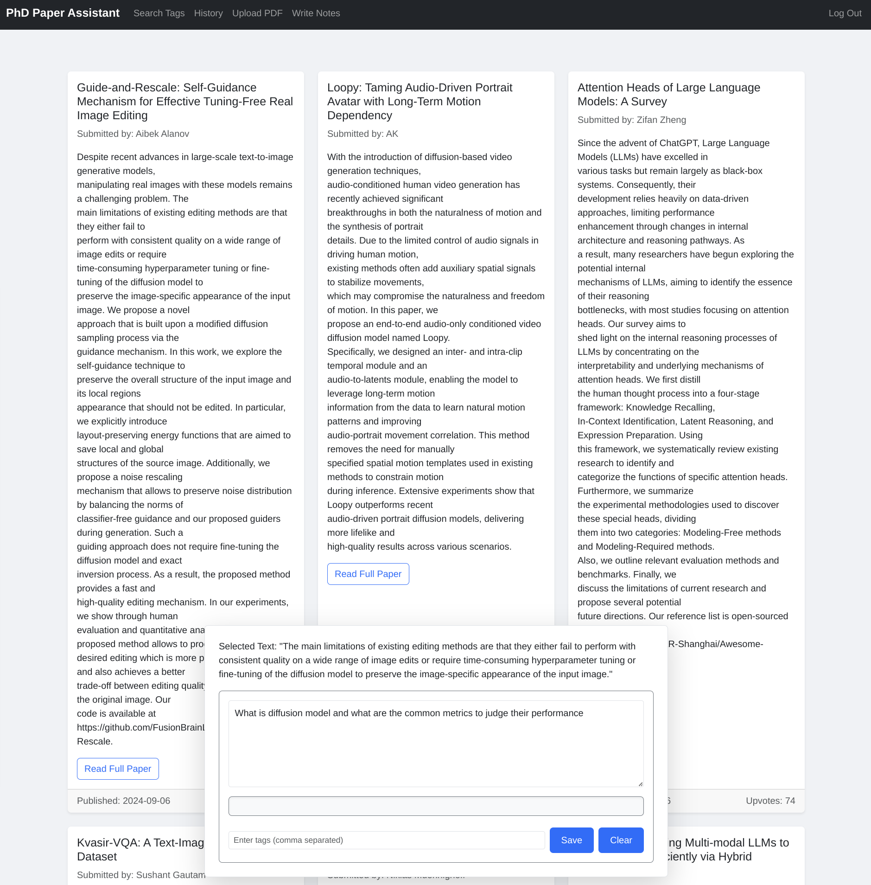

# PhD Paper Assistant

PhD Paper Assistant is a web-based tool designed to help PhD students navigate and understand complex research papers, particularly those filled with machine learning (ML) jargon. By leveraging the power of the Hugging Face blog and Llama 3.1, hosted on the Ollama server, this tool simplifies the process of reading and comprehending cutting-edge research.



## Features

### 1. User Authentication

- **Registration & Login:** Users can create an account and log in to access personalized features.
- **Secure Access:** The authentication system ensures that each user's data and interactions are anonymous.

### 2. Hugging Face Paper Feed

- **Live Feed:** Once logged in, users can see the latest papers from Hugging Face.
- **REST API:** The feed is fetched via a simple REST API call, ensuring that the latest papers are always available.

### 3. Interactive Front-End

- **Text Selection:** Users can select any text on the page and right-click to interact with it.
- **Ask Ollama Box:** This feature pops up when text is selected, providing:
  - A text input for queries.
  - "Save" and "Clear" buttons for managing interactions.
  - Display of the selected text (context) for the query.
- **Llama 3.1 Integration:** Powered by the Ollama Python API, enabling continuous and coherent conversations with Llama 3.1.

### 4. Conversation Management

- **Contextual Queries:** The selected text provides context, helping users to ask more precise questions.
- **Message History:** All communication with Llama 3.1 is stored until cleared, allowing users to build on previous discussions.

### 5. Saving & Tagging

- **Save Conversations:** Users can save their discussions as tags for future reference.
- **History Tab:** View all saved discussions, allowing users to revisit and reflect on previous interactions.
- **Search Functionality:** Filter saved discussions using specific tags. For example, searching for "language model" will retrieve all relevant conversations.

### 6. Zettelkasten System

- **Zettels:** Summarize and save discussions as zettels, which are searchable using prefixes. This helps users create refined concepts over time.

### 7. Hardware and Performance

- **Tested Configuration:** The application is tested on a GTX 1080 with 8 GB VRAM and 48 GB DDR3 RAM. Performance may vary based on the hardware.
- **Scalability:** Depending on the number of users, more powerful hardware may be required for optimal performance.

### 8. Educational Application

- **Classroom Use:** Professors can set up servers to push meaningful papers to students. Students can then interact with the bot to understand the material.
- **Collaborative Learning:** By comparing summaries from different students, the system can highlight diverse approaches to the same topic, providing valuable insights.

## Getting Started

### Prerequisites

- **Python 3.7+**
- **Ollama Server Setup:** Ensure Llama 3.1 is hosted on an Ollama server.
- **GTX 1080 (or equivalent) with 8 GB VRAM**

### Installation

1. **Clone the Repository:**

   ```bash
   git clone https://github.com/yourusername/phd-paper-assistant.git
   cd phd-paper-assistant
   ```

1. Install Dependencies:

```bash
pip install -r requirements.txt
```

1. Run the Server:

```bash
flask run
```

1. Access the Application:
Open your browser and go to <http://localhost:5000> to access the PhD Paper Assistant.

### Usage

#### Logging In

- Register or log in to your account.
- Access your daily feed of papers from Hugging Face.

#### Interacting with Papers

- Select text from summary in your feed and right-click to open the Ask Ollama box.
- Ask questions or request explanations from Llama 3.1.
- Save useful discussions as tags.

#### Managing Saved Discussions

- Use the History tab to review your past interactions.
- Filter discussions using the Search tab to find relevant tags.
- Summarize discussions into zettels for future reference.

### Contributing

#### Fork the Repository

Click the "Fork" button on the top right of the repository page.

### Create a New Branch

```bash
git checkout -b feature-branch-name
```

#### Make Your Changes

- Implement your feature or fix a bug.

```bash
git commit -m "Description of changes"
```

#### Push to Your Fork

```git push origin feature-branch-name```

#### Create a Pull Request

Go to the original repository and click "New Pull Request."

### License

- This project is licensed under the MIT License - see the LICENSE file for details.

### Acknowledgements

- Hugging Face: For providing access to cutting-edge research papers.
- Ollama: For hosting Llama 3.1 and providing an API for interaction.
- CS50 Ducky: Inspiration for creating an interactive educational tool.

### Contact

For any queries or support, please raise an issue.
